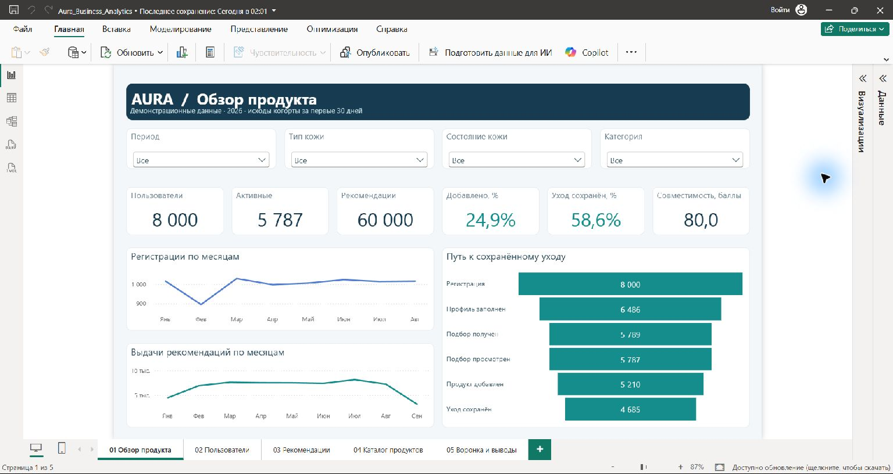
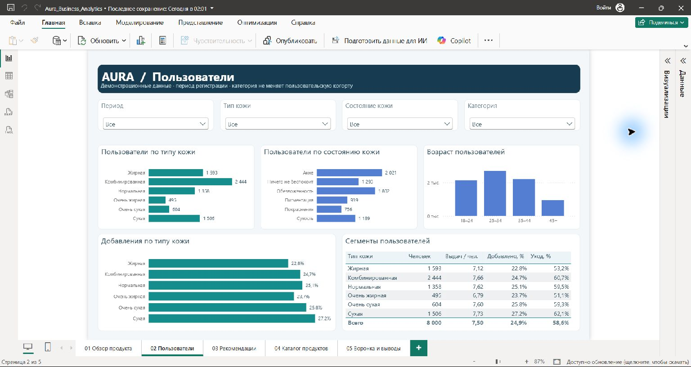
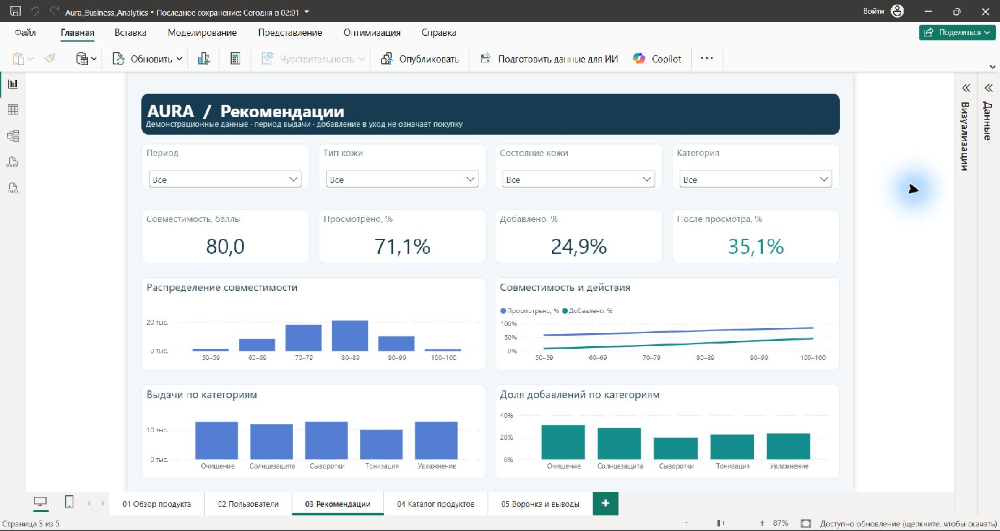
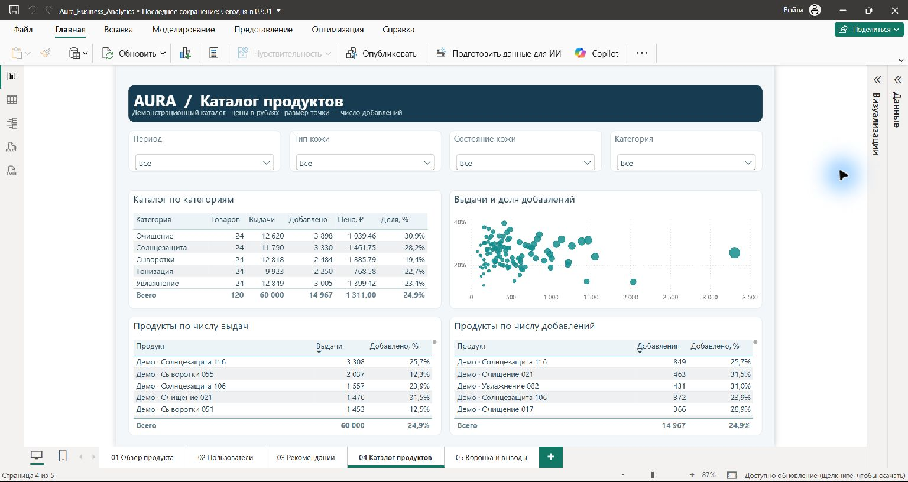
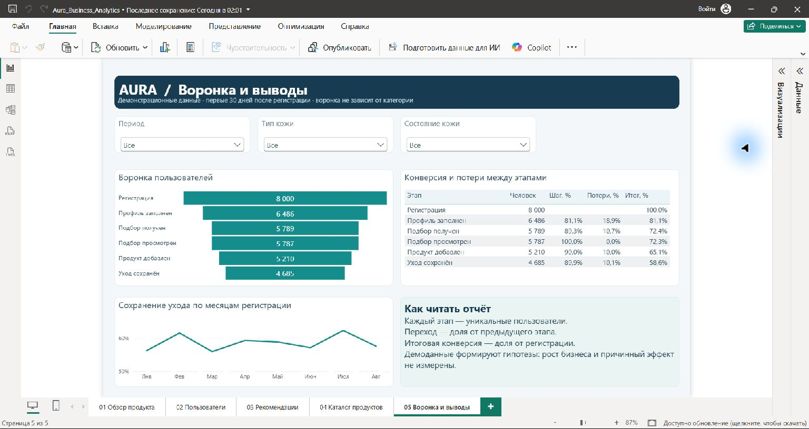

# AURA — аналитика продукта в Power BI

**Портфолио бизнес-аналитика: путь пользователя от регистрации до сохранённого ухода.**

Проект отвечает на три вопроса: где пользователи прекращают подбор, какие рекомендации добавляют в уход и какие изменения стоит проверить следующими. В комплект входят пятистраничный отчёт Power BI, исходники модели и браузерный интерактивный дашборд.

**[Открыть интерактивный дашборд](https://kristinashishigina00.github.io/aura-powerbi/)** · [Скачать Power BI](powerbi/Aura_Business_Analytics.pbix?raw=true) · [Аналитический отчёт PDF](reports/Aura_Analytics_Report.pdf) · [Выводы и гипотезы](docs/analytics-report.md)

## Бизнес-задача

«Аура» — система персонализированного подбора косметики. Аналитический слой помогает сопоставить заполнение профиля, полученные рекомендации, просмотры, добавление продукта и сохранение ухода. Основной результат — система метрик и проверяемые гипотезы для улучшения пользовательского пути.

**Данные демонстрационные.** Набор включает 8 000 пользователей, 120 продуктов и 60 000 рекомендаций. Регистрационные когорты: январь–август 2026 года. События наблюдаются до 30 сентября; окно результата — первые 30 дней от регистрации. Реальные персональные записи, продажи и эффект внедрения здесь не измерены.

## Аналитическая работа

- Сформулированы вопросы к продукту и определения KPI с явными числителями и знаменателями.
- Подготовлена семантическая модель с пользовательским, продуктовым и событийным уровнями данных.
- Реализованы 24 меры DAX и фильтрация по периоду, типу и состоянию кожи, категории продукта.
- Созданы пять страниц отчёта: от обзора продукта до воронки и гипотез улучшения.
- Наблюдения связаны с дальнейшими исследованиями и необходимой продуктовой телеметрией.

Стек: **Power BI Desktop, Power Query, DAX, PBIP/PBIR, CSV**. Браузерная версия использует встроенные данные, JavaScript и SVG.

## Страницы отчёта

| Страница | На какой вопрос отвечает |
| --- | --- |
| 01. Обзор продукта | Каковы объём выдачи, активность и путь к сохранённому уходу? |
| 02. Пользователи | Какие сегменты различаются по заполнению профиля и поведению? |
| 03. Рекомендации | Как связаны показанная совместимость, просмотры и добавления? |
| 04. Каталог продуктов | Какие продукты часто выдаются и какие чаще добавляются? |
| 05. Воронка и выводы | Где теряются пользователи и что исследовать следующим? |

Посмотреть остальные страницы Power BI

### Пользователи

### Рекомендации

### Каталог продуктов

### Воронка и выводы

## Основные показатели

Контрольные значения для полного набора, без фильтров:

| Показатель | Значение | Основание |
| --- | ---: | --- |
| Пользователи | 8 000 | Регистрационная когорта |
| Профиль заполнен | 81,1% | 6 486 / 8 000 пользователей |
| Просмотр рекомендаций | 71,1% | 42 654 / 60 000 элементов выдачи |
| Добавление в уход | 24,9% | 14 967 / 60 000 элементов выдачи |
| Уход сохранён | 58,6% | 4 685 / 8 000 пользователей |
| Средняя совместимость | 80,0 из 100 | Среднее по показанным рекомендациям |

Просмотр одного элемента выдачи и прохождение пользовательского этапа воронки — разные метрики. Повторные просмотры не увеличивают число уникальных просмотренных рекомендаций. [Определения и поведение фильтров](docs/metrics.md).

## Выводы по демонстрационному набору

1. До заполнения профиля теряются **1 514 пользователей (18,9%)**. Следующий шаг — исследование анкеты и событий её прохождения.
2. **525 пользователей** добавили продукт, но не сохранили уход. Следующий шаг — разделить намерение добавить, успешный запрос и сохранённый план.
3. Доля добавлений растёт с диапазоном показанной совместимости: **13,8%** при 60–69 баллах и **37,1%** при 90–99. Связь заложена в генераторе демоданных и требует проверки на реальном продукте.

[Полный аналитический отчёт](docs/analytics-report.md) содержит доказательства, ограничения и предложения следующего исследования.

## Материалы проекта

| Материал | Содержание |
| --- | --- |
| [Power BI PBIX](powerbi/Aura_Business_Analytics.pbix) | Готовый отчёт с данными |
| [Исходники PBIP](powerbi/Aura_PBIP_Source.zip) | Семантическая модель, Power Query и определения визуализаций; распаковать перед открытием |
| [Меры DAX](docs/dax-measures.md) | 24 исходные меры с формулами |
| [DAX-запрос](powerbi/measures.dax) | Контрольный запрос для DAX Query View |
| [Модель данных](docs/data-model.md) | Таблицы, связи, единицы хранения и временной контекст |
| [Данные](data/README.md) | Семь исходных CSV, объёмы и ограничения |
| [PDF-отчёт](reports/Aura_Analytics_Report.pdf) | Краткий разбор и пять скриншотов Power BI Desktop |
| [Интерактивная версия](site/index.html) | Пять страниц, фильтры, сортировка, подсказки и печать |
| [Проверка комплекта](docs/verification.md) | Что проверено при подготовке архива |

## Как открыть Power BI

Скачайте [PBIX](powerbi/Aura_Business_Analytics.pbix?raw=true) и откройте его в актуальном Power BI Desktop на Windows. Исходная версия сохранена в Desktop 2.157.1354.0. Данные встроены, подключение к БД и настройка локальных путей не требуются.

Для изучения исходников распакуйте [PBIP-архив](powerbi/Aura_PBIP_Source.zip?raw=true) и откройте `Aura_Business_Analytics.pbip`. Сохраните рядом папки `Aura.Report` и `Aura.SemanticModel`. При первом открытии выполните обновление данных: локальный кэш исключён из комплекта.

Браузерная версия воспроизводит основные аналитические срезы на том же демонстрационном наборе. Для исполнения DAX и работы с моделью используйте PBIX. Подключение именно опубликованного отчёта Power BI Service описано в [инструкции](docs/publishing.md#power-bi-service).

## Автор

**Кристина Шишигина** — бизнес-аналитик с техническим бэкграундом.

[GitHub](https://github.com/KristinaShishigina00) · [Telegram](https://t.me/krishigina) · [Основной проект Aura](https://github.com/KristinaShishigina00/Aura)
