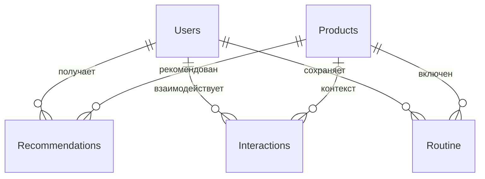

# Аналитическая модель данных

[Главная](../README.md) · [Метрики](metrics.md) · [Исходные CSV](../data/README.md)

| Таблица | Строк | Одна запись |
| --- | ---: | --- |
| Users | 8 000 | Пользователь и первые этапы его пути |
| Products | 120 | Продукт учебного каталога |
| Recommendations | 60 000 | Один продукт в одной выдаче рекомендаций |
| Interactions | 127 535 | Отдельное событие взаимодействия |
| Routine | 10 638 | Первое сохранение продукта в уход пользователя |
| Date | 273 | День календаря с января по сентябрь 2026 |
| FunnelStages | 6 | Этап пользовательской воронки |

## Основные связи

Активные связи Users и Products с фактами обеспечивают фильтрацию от справочника к событиям. В Interactions продукт и рекомендация могут отсутствовать у событий регистрации либо профиля.

Связь Interactions → Recommendations объявлена **неактивной**, чтобы не создавать неоднозначные активные пути фильтрации через Users и Products. Для анализа цепочки событий её необходимо активировать явно в соответствующем расчёте, а не считать всегда действующей.

## Временной контекст

Основная таблица Date используется как отключённый календарь выбора. Меры передают её выбранные даты через `TREATAS` в нужное поле: Users.registration_day, Recommendations.recommendation_day или Interactions.event_day. Это позволяет одной странице сравнивать показатели с разным смыслом даты.

FunnelStages также не соединена физическим FK. Мера `Funnel Users` получает выбранный stage_id через `SELECTEDVALUE` и считает Users.funnel_level ≥ номер этапа.

В сохранённой модели дополнительно присутствуют служебные автоматические таблицы дат Power BI. Они не включены в семь бизнес-таблиц и не являются отдельными CSV-источниками.

## Подготовка данных

CSV имеют UTF-8 BOM; даты и время представлены в ISO 8601. Пустые значения сохраняют отсутствие события. Каждая таблица помечена как Synthetic / Demo Data.

Power Query в PBIP содержит встроенные сжатые данные. После распаковки проекта обновление не зависит от абсолютных путей компьютера автора. PBIX уже содержит модель и данные. Полные определения M, таблиц, вычисляемых колонок и визуализаций находятся в [архиве PBIP](../powerbi/Aura_PBIP_Source.zip).
